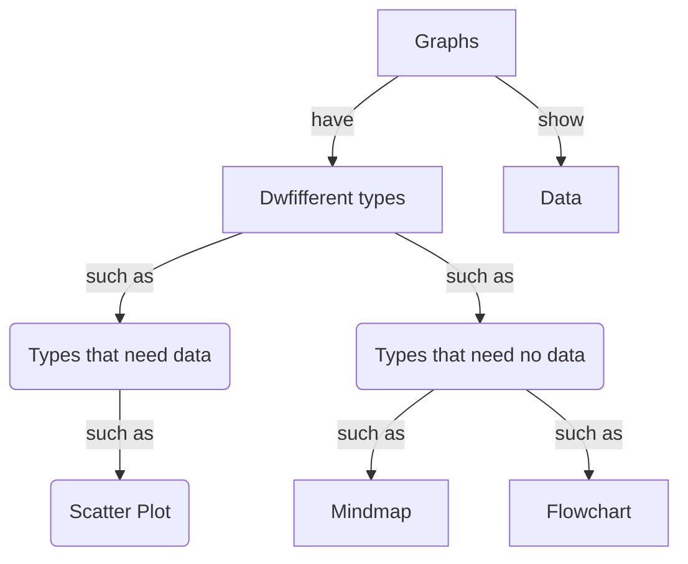

# penatagon_hack

```mermaid
flowchart TD
    Graphs --> |have| Types[Dwfifferent types]
    Graphs --> |show| Data
    Types --> |such as| TypesData(Types that need data)
    Types --> |such as| TypesNoData(Types that need no data)
    TypesNoData --> |such as| Mindmap
    TypesNoData --> |such as| Flowchart
    TypesData --> |such as| ScatterPlot(Scatter Plot)
```
